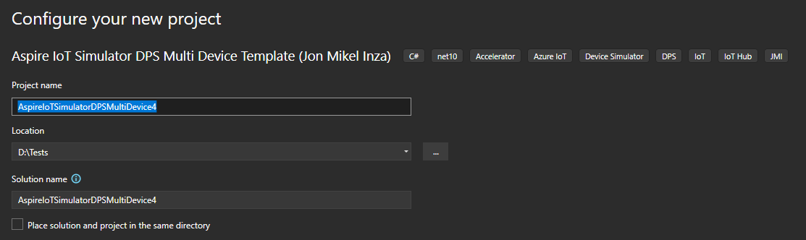
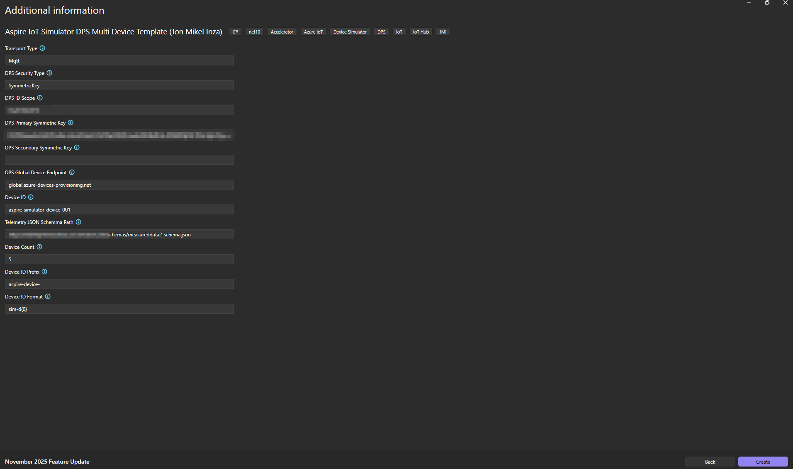
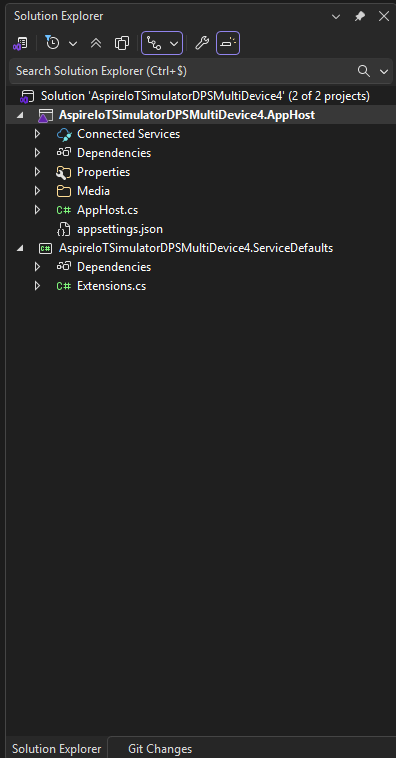

# Aspire and IoT

Aspire has become way more than just a nice tool. Today it adds actual value when it comes to developing different types of applications through:
 - local monitoring
 - configuration definition and management
 - architecture definition and management
 - delivery

The variety of covered applications and languages makes Aspire a very versatile tool (not bound at .NET only).

Its native integration with GitHub Copilot is also very interesting when it comes to debugging.

Last but not least, its extensibility model and MCP server complete Aspire possibilities and contribute to its great popularity.

Obviously, it does not cover everything but the value created in terms of development experience is more than tangible.

More information about Aspire:
 - [Aspire.Dev](https://aspire.dev/?WT.mc_id=AZ-MVP-5004280)
 - [Learn](https://learn.microsoft.com/en-us/dotnet/aspire/?WT.mc_id=AZ-MVP-5004280)

# Why to use Aspire with IoT?

Some of the shared IoT Devices are shipped as containers. They are designed to be used through CLI either automatically or by hand.
However, from the develoment perspective, in some cases Aspire might be practical and offers a fast way to use the mentioned simulators.

Also, this might be an unusual use case, worth it being mentioned.


# Visual Studio and .NET CLI extensions

The proposed extensions create solutions templates to use the IoT Devices simulators:
 - containerized [single device simulator](https://hub.docker.com/r/jonmikeli/iot-simulator-dps)
 - containerized [multi device simulator](https://hub.docker.com/r/jonmikeli/iot-simulator-dps-multi)

 The first one simulates most of the IoT flows (D2C, C2D) covered by the Azure IoT Hub SDK (c#).
 It covers also different security types (SAS, X509) and DPS provisioning.
 Many aspects are configurable and telemetry might be created based on a JSON Schema (randomly).
 More information [here](/iot/tools/simulators/iot-simulator-single-device-container.md).

 The second one covers the same flows with the following differences:
  - the container simulates many devices at the same time (in one single container). The number is configurable.
  - X509 security type is not covered
  More information [here](/iot/tools/simulators/iot-simulator-multi-device-container.md).

  Extensions:
   - Visual Studio [Single device extension](https://marketplace.visualstudio.com/items?itemName=JonMikelInza.AspireIoTSimulatorDPSSingleDeviceTemplate)
   - .NET CLI [Single device extension](https://www.nuget.org/packages/JMI.Aspire.IoTSimulator.DPS.SingleDevice.Template/)
   - Visual Studio [Multi device extension](https://marketplace.visualstudio.com/items?itemName=JonMikelInza.AspireIoTSimulatorDPSMultiDeviceTemplate)
   - .NET CLI [Multi device extension](https://www.nuget.org/packages/JMI.Aspire.IoTSimulator.DPS.MultiDevice.Template/)

# How to install the extensions?

Visual Studio Extensions (VSIX):
 - through the Visual Studio Explorer
 - through the Visual Studio Marketplace
   - download the extensions
     - [Single device](https://marketplace.visualstudio.com/items?itemName=JonMikelInza.AspireIoTSimulatorDPSSingleDeviceTemplate)
     - [Multi device](https://marketplace.visualstudio.com/items?itemName=JonMikelInza.AspireIoTSimulatorDPSMultiDeviceTemplate)
   - double click on the VSIX and follow the instructions

.NET CLI (NuGet):
 - through the NuGet official repository
   - [Single device](https://www.nuget.org/packages/JMI.Aspire.IoTSimulator.DPS.SingleDevice.Template/)
   - [Multi device](https://www.nuget.org/packages/JMI.Aspire.IoTSimulator.DPS.MultiDevice.Template/)


# How to use the extensions?

## VSIX

  - Create the solution

  

  - Set the solution name and location

  

  - Configure the template

  

  - Created solution

   

  - Run the solution


  > NOTE
  >
  > Solution settings are at appsettings.json level. They can be updated whenever it is needed.

## .NET CLI

```bash
dotnet new 
```

# What is coming next?

Next steps might depend on feedback and detected needs.
This said, one natural next step could be to complete the telemetry generator with AI features (through Azure AI Foundry).
This would also showcase a complete use case of:
 - existing tool
 - integrated with Aspire
 - enriched with Azure AI Foundry
 

<sub><sub>Not created with GenAI.</sub></sub>