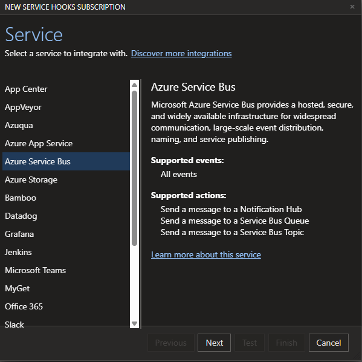
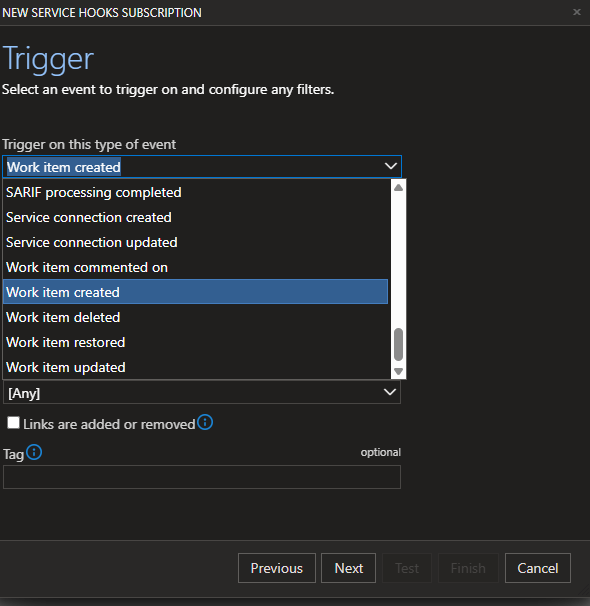

# Azure DevOps - How to extend and enrich ADO

Azure DevOps Work Items are a fantastic way to manage the whole production flow in software development, covering:
 - portfolios
 - features (globally speaking)
 - requirements
 - work to be done
 - tests

 ADO includes basic rules and flows.
 However, it is quite common to be confronted to specific needs, in daily life.

 This publication will discribe one of the ways to extend the native ADO possibilities.

 # Main approach

ADO Team Projects include service hooks of different types (HTTP, Messages, etc).
One of those hooks allow to publish events though Azure Service Bus messages.

Those messages are created according to configurable triggers.

In this case, we will configure the work item creation trigger.

Once messages are published, they can be consummed by different services (ex: Azure Function) and apply specific business logics to control, complete or update Work Items. This process can also be used to fed analytical metrics and indicators.

 # Example

[Repo](https://github.com/jonmikeli/ado-wi-hierarchies-management)