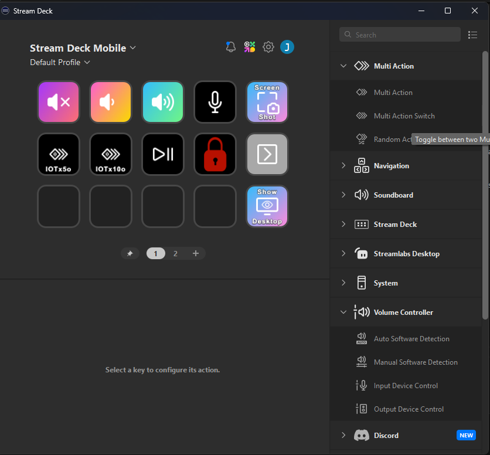
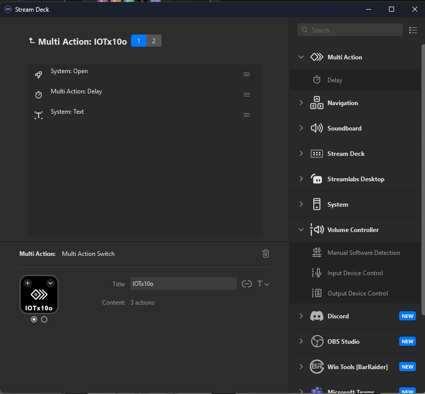

# IoT simulators with Elgato Stream Deck

This project go a bit further when it comes to the use of the already implemented set of tools and simulators.

Having such tools is great. However, from the practical perspective, some projects or contexts might require:
 - using different configurations of the tools
 - have access to them in a fast and easy way

Instead of building another application being used as hub for all the tools, using a stream deck might be a good alternative.

This article describes how to use an [Elgato Stream Deck](https://www.elgato.com/us/en/p/stream-deck-mk2-black) to control the IoT simulators.

Have fun ;).

## Prerequisites

- [Elgato Stream Deck](https://www.elgato.com/us/en/p/stream-deck-mk2-black)
- Elgato Stream Deck software installed
- Elgato mobile application (optional)
- Docker installed

> [!IMPORTANT]
>
> Be sure that Docker is running on your computer before using the simulators.


## Configuration

The idea here is to use a stream deck to control different IoT simulators answering to different contexts:
 - different configurations
 - different projects

The content of the article will be based on the containerized version of the IoT Simulator (multidevice).
If you need more details, you can find them [here](../tools/simulators/iot-simulator-multi-device-container.md).

When it comes to stream decks, Elgato offers very popular products. They even include a mobile application.
The article describes how to use physical Elgato Stream Deck and also, the mobile application.

This way, you can imagine additional alternatives to your use cases.


### Mobile application

> [!NOTE]
>
> Be sure that Elgato Stream Deck software is installed on your computer and that the mobile application is also installed on your mobile device.
> You do not need a physical Elgato Stream Deck to use the mobile application. This said, the experience is richer with the physical device.
>

To use the mobile application, you will need to pair your application with the computer where the Elgato Stream Deck software is installed.
The pairing is done from the mobile application.


Once the pairing is done, the actual configuration might start.

Depending on the type of membership you have, you can add more or less configurable buttons.
This said, the configuration of simulations remains the same.


### Adding a new button

Steps:
 - drag and drop a Multitask Action Switch button to the stream deck configuration area
 - give a name to the button
 - configure the two actions of the button



#### Action 1

The first action starts the simulation:

- add a System Open action with the following parameters:
  - Title: Open a terminal
  - App/file: cmd
- add a Multi Action of type Delay with the following parameters:
  - Title: Delay
  - Delay: 1000 ms
  This step is needed to be sure the terminal is opened before sending the command.
- add a System Text action with the following content:
  ```bash
    docker run -ti --rm --name DeviceSymJMIMulti \
    -e DPS_SECURITY_TYPE="SymmetricKey" \
    -e TRANSPORT_TYPE="Mqtt" \
    -e DPS_IDSCOPE="TO BE REPLACED" \
    -e DPS_PRIMARY_SYMMETRIC_KEY="TO BE REPLACED" \
    -e MULTIDEVICE_DEVICE_COUNT=10 \
    -e MULTIDEVICE_DEVICE_PREFIX="sim-" \
    -e MULTIDEVICE_DEVICE_ID_FORMAT="test-d{0}" \
    --network="host" \
    jmiacr.azurecr.io/iot-simulator-dps-multi:8.2.785.2258
  ```




#### Action 2

The second action stops the simulation:

 - add a System HotKey action with the following parameters:
   - Title: Ctrl
   - Hotkey: Ctrl
 - add a System Text action with the following content:
   - Title: 
   - Text: c
 - Add a System HotKey action with the following parameters:
   - Title: Return
   - Hotkey: Return
 - Add a System Text action with the following content:
   - Title: 
   - Text: exit


> [!NOTE]
>
> Screenshots are taken from the mobile profile configuration. The desktop version is similar.


### Stream Deck

If you have a physical Elgato Stream Deck, the configuration is similar to the mobile application.


## Nex steps

You can configure as many buttons and simulators as you want, taking into account a rich set of use cases.
This might be very useful and time saving when it comes to testing or demonstrations.