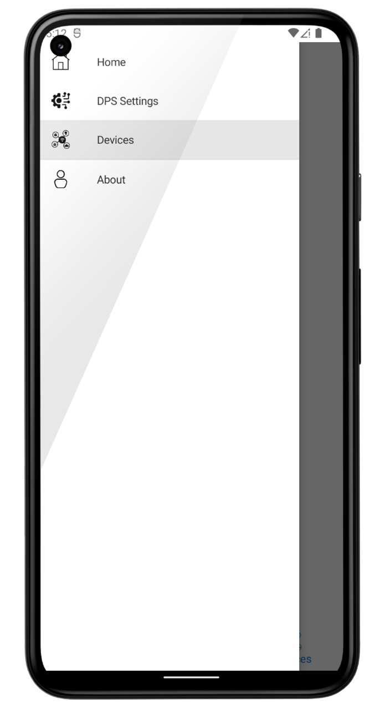

# Azure IoT Simulator - Mobile application

You are a developer and want a simple tool to create virtual devices and test IoT flows?

If so, this post is probably for you.

> [!NOTE]
> Exported content from Microsoft technical blog post (+20k).
> Original content can be found [here](https://techcommunity.microsoft.com/t5/internet-of-things-blog/transform-your-phone-into-an-iot-device-with-net-maui/ba-p/3673909?WT.mc_id=AZ-MVP-5004280).
>
> Reorganization within Microsoft's blog content has made the publication not visible. In case the content is still useful for the community, it has been exported here.

 

# Why such an application?
 

When working on IoT projects, sooner or later, you will need to test the integration of the “device side” with the “solution side”. There are many alternatives for this (UI-oriented or command-line-oriented).

[Azure IoT Explorer](https://learn.microsoft.com/azure/iot-fundamentals/howto-use-iot-explorer?WT.mc_id=AZ-MVP-5004280) is probably one of the most known among Microsoft's tools. It is a graphical tool covering a large set of features and IoT flows. However, it is a desktop application.

Microsoft has also developed an [IoT Plug and Play Mobile App](https://play.google.com/store/apps/details?id=com.iot_pnp&hl=en&gl=US). It is very easy to use. Nevertheless, it is focused on Azure IoT Central.

I was missing a more generic tool, a bit more versatile and keeping the same level of simplicity. So, why not create a mobile application implementing most of the common IoT flows and allowing to simulate not only one virtual device but many of them? That was the beginning of Azure IoT Mobile Device.

 

Before going deeper into the application, let's remind first some basic concepts about IoT solutions. This will help to understand better what the application is for and what it does.

 

# Azure IoT Services and technical stack
 


An IoT Solution might include many Azure services. Most of the time, they include at least:

 - A DPS
 - One or more IoT Hubs

In recent architectures, other approaches might include raw MQTT brokers (ex: Azure Event Grid or others).
This publication does not cover those approaches (yet :)).

These services are usually completed by many others (not an exhaustive list):

- Azure Storage
- Azure Service Bus
- Azure Event Hub
- Azure Event Grid
- Azure Cosmos DB
- Azure Stream Analytics
- Azure Data Explorer
- Azure SQL Database
- Azure Functions
- Azure Stream Analytics
- Azure App Services
- Azure Key Vault
- Azure App Configuration
- Azure Active Directory
- Azure Kubernetes Service
- Azure Container Registry
- Azure Monitor

And many others if we extend the perimeter with AI, data analysis, BI, security, etc.
Special mention to Microsoft Fabric, which is taking and important place (and role) in solutions where data plays a decisive role.
 

Obviously, each project is unique, and the list of the truly used services depends on the requirements of each solution.


In this post, we will only use an Azure IoT Hub DPS (DPS) and a linked Azure IoT Hub. The idea is to avoid being dispersed and keep our attention at the application level. If you are interested in IoT architectures, you can find more information here.


DPS works together with at least one Azure IoT Hub. Its role is to simplify the provisioning mechanism with guarantees in terms of security, availability, reliability, and scalability.
 

In very simple words, “provisioning” is the action that takes in charge:

The creation of an identity for a given device
The creation and transfer of the needed security artifacts (identity, connection string, etc) to the device
 

You will find [here](https://learn.microsoft.com/azure/iot-dps/about-iot-dps?WT.mc_id=AZ-MVP-5004280) more details about Azure IoT Hub DPS and the provisioning process.


Once the provisioning is done, the devices can communicate with the assigned IoT Hub in a secure way. It is important to mention that the IoT Hub can also interact with the device (Cloud To Device flows, C2D), which unlocks very interesting possibilities.


When it comes to the application, I have considered different alternatives and technologies to implement it (Microsoft and not Microsoft). In the end, the set of technologies that offered the best value (features, tools, learning curve, productivity, etc) were:
 - [MAUI](https://learn.microsoft.com/dotnet/maui/what-is-maui?WT.mc_id=AZ-MVP-5004280)
 - [.NET, C#](https://dotnet.microsoft.com/learn/csharp?WT.mc_id=AZ-MVP-5004280)
 - [IoT Hub SDK](https://learn.microsoft.com/azure/iot-hub/iot-hub-devguide-sdks?WT.mc_id=AZ-MVP-5004280), C# (device side)
 - [Azure](https://azure.microsoft.com/?WT.mc_id=AZ-MVP-5004280) (PaaS, [Azure IoT Services](https://azure.microsoft.com/solutions/iot/#overview?WT.mc_id=AZ-MVP-5004280))
 


> [!NOTE]
>
> The application has only been tested on Android phones. There is no particular reason for this; just a logistic problem since I do not have the required material to work on iOS.


 

Tools and IDEs:
 - [Visual Studio 2022](https://visualstudio.microsoft.com/?WT.mc_id=AZ-MVP-5004280) with MAUI’s prerequisites ([prerequisites and configuration](https://learn.microsoft.com/en-us/dotnet/maui/get-started/installation?tabs=vswin&WT.mc_id=AZ-MVP-5004280))
 - [Azure IoT Hub SDK](https://learn.microsoft.com/azure/iot-hub/iot-hub-devguide-sdks?WT.mc_id=AZ-MVP-5004280?WT.mc_id=AZ-MVP-5004280) (C#, device side)
 - [Azure IoT Explorer](https://learn.microsoft.com/en-us/azure/iot-fundamentals/howto-use-iot-explorer?WT.mc_id=AZ-MVP-5004280?WT.mc_id=AZ-MVP-5004280) to test and control the IoT flows
 - [Visual Studio Code](https://code.visualstudio.com/?WT.mc_id=AZ-MVP-5004280)
 - ([Custom library](https://www.nuget.org/packages/JMI.Json.Data/?WT.mc_id=AZ-MVP-5004280) to create JSON content from JSON Schemas)
 

[Azure IoT Explorer](https://learn.microsoft.com/en-us/azure/iot-fundamentals/howto-use-iot-explorer?WT.mc_id=AZ-MVP-5004280) covers a large set of features. Those used in this context are focused on C2D flows and controlling the telemetry collected at Azure IoT Hub level (see the screenshot below). The documentation provided by [Microsoft Learn](https://learn.microsoft.com/en-us/azure/iot-fundamentals/howto-use-iot-explorer?WT.mc_id=AZ-MVP-5004280) describes all the steps to install, configure and use the tool.

 
You will see later in the post how to use Direct Methods. The other features are quite simple to understand.
 


# IoT Plug and Play
 

As mentioned earlier, Microsoft has already published a mobile application to create virtual IoT devices based on [IoT Plug and Play](https://learn.microsoft.com/azure/iot-fundamentals/iot-phone-app-how-to?WT.mc_id=AZ-MVP-5004280) and focused on [Azure IoT Central](https://azure.microsoft.com/products/iot-central/?WT.mc_id=AZ-MVP-5004280). Azure IoT Mobile Device’s approach is different and more oriented to Azure IoT PaaS services. There is no “better or worse” discussion here. The approach is just different.

 

IoT Plug and Play is an interesting concept having for purpose to simplify as much as possible the user experience and help to connect a device to an IoT solution. We could say that it is similar to the PnP we know with hardware (at least, conceptually). IoT Plug and Play uses DTDL (Digital Twins Definition Language) to describe the interface (contract) of a given device type.

Azure IoT Central is also based on IoT Plug and Play, which allows very easy and fast device/solution integration, going until the automatic UI rendering based on the described [DTDL](https://github.com/Azure/opendigitaltwins-dtdl/blob/master/DTDL/v2/dtdlv2.md?WT.mc_id=AZ-MVP-5004280) models.

 

Despite the attractivity of this approach, sometimes it is not enough, and you need to use other alternatives. This is where Azure IoT Mobile Device finds its place and can help.

 

# Prerequisites
 

We have already seen that the application needs some prerequisites to work properly:

 - One or more Azure IoT Hub DPSs, to provision the devices
 - One or more Azure IoT Hubs (D2C/C2D flows)
 

To create these services, you will need an Azure Subscription. If you do not have one, you can get one for free [here](https://azure.microsoft.com/en-us/free/?WT.mc_id=AZ-MVP-5004280).  You can also use a free Azure IoT Hub if its use remains under the limits described in the [next link](https://learn.microsoft.com/azure/iot-hub/iot-hub-devguide-quotas-throttling?WT.mc_id=AZ-MVP-5004280).


> [!NOTE]
>
> If you want to use all the IoT features (C2D, Device Management, etc), do not use the Basic tiers.

 

All the needed services can be created either directly through the Azure Portal or using IaC (Infrastructure as Code). The latter offers these different alternatives:

 - ARM
 - Bicep
 - Azure CLI
 - Power Shell
 - REST API

We will provide here an Azure CLI-oriented approach but any of them is valid.

 
```bash
rg="aiot-md-rg"
location="westeurope"
iothub_name="aiot-md-iothub"
dps_name="aiot-md-dps"
enrollent_id="aiotmdegr"

#Resource group creation
az group create --name $rg --location $location

#IoT Hub creation
az iot hub create --name $iothub_name --sku S1 --resource-group $rg --location $location

#DPS Creation
az iot dps create --name $dps_name --resource-group $rg --location $location scope_id=$(az iot dps show --resource-group $rg --name $dps_name -o tsv --query "properties.idScope")

#Link between the DPS and the IoT Hub
pk=$(az iot hub connection-string show -n $iothub_name --policy-name iothubowner --key-type primary -o tsv) az iot dps linked-hub create --dps-name $dps_name --resource-group $rg --connection-string $pk

#DPS Enrollment group
az iot dps enrollment-group create -g $rg --dps-name $dps_name --enrollment-id $enrollent_id enrollmentgroup_pk=$(az iot dps enrollment-group show -g $rg --dps-name $dps_name --enrollment-id $enrollent_id --show-keys -o tsv --query "attestation.symmetricKey.primaryKey")
```
 

$scope_id and $enrollmentgroup_pk contain the needed values for the provisioning settings in the application.

Keep them for later steps.

You can also use them to create a QR code to ease the configuration input in the mobile app. Indeed, the IoT Mobile app (> v1.1.x) is built to read and interpret QR codes containing the message structure described below:
 - Symmetric QR Code content
  
   ```json
   { "idScope":"$idScope", "pk":"$enrollmentgroup_pk", "sk":"$enrollmentgroup_sk", "securityType":"symmetric", "enrollmentType":"group" }
    ```
 - X509 QR Code content
  
    ```json
   { "idScope":"$idScope", "securityType":"X509CA", "enrollmentType":"group" }
    ```


> [!NOTE]
>
> To use this application in production environments, the QR code should be created based on encrypted content. So, be aware of how and where you are using the application.
> You might wonder "when" and "how" to create the QR Code. The "when" will depend on your processes but right after the IaC scripts could be a good moment. The "how" depends also on your context. There are many alternatives (APIs, SDKs, shell commands, SaaS services, etc).

The post describes later how the application uses these QR Codes.

The provided Azure CLI commands create:

 - A resource group
 - An IoT Hub
 - A DPS
 - The DPS is linked to the IoT Hub
 - An enrollment group in the DPS


An enrollment group represents a group (logical) where devices will be managed and authorized for provisioning in the same way.

 

At this stage, we can already run the application. Let’s mention again that in real projects, the architectures will be richer and more complex. Also, it is highly probable that after many projects you will have to deal with many DPSs and IoT Hubs, similarly to the diagram below:


One of the purposes of this mobile application is to help in this scenario by offering the possibility to interact with more than one DPSs and, also, implement many virtual devices.

 

# Features implemented in the application
 

The application allows to:

 - Configure one or many Azure IoT Hub DPS instances (manually or scanning QR codes)
 - Provision one or many devices with the previous DPSs
 - Configure the IoT flows for each new device (the simulator part)
 - Visualize the logs of the configured flows
 

If you want to try the application, you can install it from [Google Play](https://play.google.com/store/apps/details?id=jmi.iot.device.mobile).

<p align="center">
<a href="https://play.google.com/store/apps/details?id=jmi.iot.device.mobile" target="_blanc">

</a>
</p>


## Home


The home screen enumerates the simulators. A simulator is nothing else than a provisioned virtual device with all the settings to initialize the simulated flows. Another view will list the devices and give access to the settings of the devices.


To create the simulators, it is necessary to cover the next steps:

 - Configure at least one DPS
 - Provision at least one device
 - Configure the simulation settings
 

## Azure IoT Hub DPS instances
 

The application allows to configure as many DPS instances as desired. This might be practical if you need to test different environments or different projects.

 
The enrollment type is limited to “Group”.

The default security type is “Symmetric Key”. “X509CA certificates” have been added in the 1.3.736 version of the application.

 

To add a DPS configuration, you only need to go to “DPS Settings” and click the “Add” button. If you have QR codes with the settings, you can also tap on the QR Code button.
 


### Manual input
 


If you are going through the manual process, the application will ask for the information below:

 - A name for the new configuration (unlocks the use of the QR Code button from this form)
 - The DPS Scope Id (see the prerequisites section and the Azure CLI script)
 - The Primary Key (see the prerequisites section and the Azure CLI script)
 - The Secondary Key, not mandatory, depending on what type of tests you want to complete
 

> [!NOTE]
>
> The Primary (and optional Secondary) Keys are only needed with the Symmetric Key security type.
>
> X509CA does not require any key. From the device perspective, it only requires a device (leaf) certificate issued from the certificates registered in the DPS (verified) and use at Enrollment Group levels.

 

All these values are also available at the Azure Portal.

 

### QR Code

Instead, if you follow the QR Code path, the app will enable the camera to scan the codes.

 

> [!NOTE]
>
> If you have started the manual process, you still can use the QR Code scan (QR code button next to the "Scope Id" label). In this case, the DPS Settings name needs to be provided to unlock the QR Code button.

 

When a QR code is detected, the screen shows its content and you can add the settings to the application. If you go to the QR scanning screen from the DPS Settings list screen, the name of the setting will be created automatically.


 

After leaving the QR code scanning screen, you might be redirected either to the DPS Settings (list) screen or to the DPS Settings (item) screen, depending on where you started the scanning process.

 

### DPS Settings details

If you look into the DPS Settings details, you might notice that some of the properties are not editable in the current version:

 - Global DPS Url, unique and provided by Azure
 - Security Type ("Symmetric Key" or "X509CA")
 - Enrollment type ("Group" for now)

> [!NOTE]
>
> For additional details about how to create X509 certificates (root, intermediate, leaf), follow this [link](https://github.com/jonmikeli/docs/blob/main/iot/tools/mobile-app/iot-mobile-device-x509-public-documentation.md). These instructions have been put out of this publication to avoid extending this content too much and keep the focus of the post on the app and IoT experience.

Once the required information has been provided, you can save the settings and go to the next step.


## Provisioning and device configuration
 

The provisioning step covers many actions for you:

 - The DPS takes into account the request and processes it
 - It assigns the appropriate IoT Hub according to the DPS rules
 - It creates an identity for the device in the mentioned Azure IoT Hub
 - It gets a connection string and sends it back to the mobile application
 

> [!NOTE]
>
> The application persists the connection string in insecure ways for production-oriented use. This is not a big concern at this stage, where the application is more a tool and/or a pedagogical example. However, if at some point the application goes further, these types of secrets have to be stored in more secure ways.

 

To provision a device, the application will request:

 - A configured DPS (picker with the configured DPSs)
 - A name for the device to be provisioned
 

The “Simulator” button will unlock once all the settings have been provided.


Note that if the device is provisioned properly, a green icon is displayed at the right of the "Connection String" label. You will find this same icon in all the application to distinguish visually the devices (and the related simulator) ready to be used (provisioned and with a connection string).


At this stage, we already have a configured DPS and a first provisioned virtual device.

You will also see the new device in the list of provisioned devices.

 

If you add not provisioned devices, they will also be visible in the list but without the green icon.


If you try to provision an already existing device, the DPS will send in return the existing connection string. No error will be raised.


## Simulator configuration
 

The application covers a complete set of IoT features:

 - D2C
   - Telemetry messages - Regular known telemetry from a device to the cloud. The sending interval is configurable (in seconds);
   - [Twin Reported Properties](https://learn.microsoft.com/azure/iot-hub/iot-hub-devguide-device-twins?WT.mc_id=AZ-MVP-5004280) (not configurable directly in this version) - Part of the Device Twin features;
   - [File Upload](https://learn.microsoft.com/azure/iot-hub/iot-hub-devguide-file-upload?WT.mc_id=AZ-MVP-5004280) - Allowing to send a set of messages, images, video, etc. This version of the application creates a set of random messages based on the telemetry schema (JSON Schema, described later in the post). Images and other types of media are not included in this version. The sending interval is configurable (in seconds).
 - C2D
   - [Direct Methods](https://learn.microsoft.com/azure/iot-hub/iot-hub-devguide-direct-methods?WT.mc_id=AZ-MVP-5004280) (C2D-DM) - Allowing to send requests from the cloud to a device, to execute commands;
   - [Messages](https://learn.microsoft.com/azure/iot-hub/iot-hub-devguide-messages-c2d?WT.mc_id=AZ-MVP-5004280) (C2D-M) – Similar to Direct Methods but with asynchronous messages;
   - [Twin Desired Properties](https://learn.microsoft.com/azure/iot-hub/iot-hub-devguide-device-twins?WT.mc_id=AZ-MVP-5004280) (C2D-DP) – Part of the Device Twin features.

> [!NOTE]
>
> If you want to use the [File Upload feature](https://learn.microsoft.com/en-us/azure/iot-hub/iot-hub-devguide-file-upload?WT.mc_id=AZ-MVP-5004280), it has to be enabled and configured at IoT Hub level. Otherwise, the application will raise an exception (expected and normal behavior). This requires creating an Azure Storage account, a container and configuring the IoT Hub to store the uploaded files into it. Step-by-step details are described at the provided link.

The IaC code seen previously in this post does not enable this feature.

 

If any of these features are not familiar to you, follow the provided links for each feature. You will find all the necessary information at [Microsoft Learn](https://learn.microsoft.com/en-us/?WT.mc_id=AZ-MVP-5004280) (either at the regular documentation level or at the great [IoT Show channel](https://learn.microsoft.com/en-us/shows/internet-of-things-show/?WT.mc_id=AZ-MVP-5004280)).

 

### Telemetry interval
 

The interval to send telemetry can be configured (value in seconds):

 - Directly, through the “Telemetry Interval” property at the screen
 - Through a C2D-Direct Method (SetTelemetryInterval).
   Parameter: int (interval in seconds).
   To use this Direct Method, the simulator has to be running and the check mark “C2D-DM” has to be checked.
 

In case you do not have a way to send the Direct Method requests, you can use [Azure IoT Explorer](https://learn.microsoft.com/en-us/azure/iot-fundamentals/howto-use-iot-explorer?WT.mc_id=AZ-MVP-5004280).


The payload takes the new interval (in seconds).


### Other direct methods
 

Talking about Direct Methods, the application includes a generic handler.

No special actions are implemented after those Direct Methods are called. The requests are logged and displayed at C2D level, which allows to test and control that the mechanism works.

 
The name of the Direct Methods and their signature are not important. You can use whatever you want.


Remember that the simulator needs to be connected, running and with the checkmark "C2D-DM" checked.


As you can see in the screen below, the application displays a short trace of the requests.

 
### Message structure
 

The message structure can be defined with a configurable JSON Schema. When tapping on the button "Message structure", the application will ask you to locate the file containing the JSON Schema and it will display its content.

 

This schema will be used to generate random JSON messages. The randomization mechanism is very rudimentary in this first version.


### Other simulation settings
 

C2D Messages (C2D-M) and Twin Desired Properties (C2D-DP) work in a similar way to the generic Direct Method handler.

Whatever you send to the virtual device, it is logged and displayed at the C2D logs level.


If C2D-Read TP is checked, Device Twin Properties are read and displayed at start time.


Once all the settings have been provided, they can be persisted with the “Save” button. You can also change them whenever you want. Stop the simulator to make the changes.


> [!NOTE]
>
> Keep in mind that the device needs to be provisioned (green icon) to start using the simulator. The application will guide you through the process, keeping you safe from doing inappropriate operations.


### Simulation running screen


The running section of the simulator (yellowish) is just below the configuration section (blue).

It includes simple logs of D2C and C2D flows but enough to see how your "new IoT phone" is interacting with an IoT Solution. This is, by the way, a simple way to observe how impressively well are designed the underlying technologies (SDKs, Azure Services, etc).

 
## About
 

The About screen includes:

 - Different types of information about the application (version, author words, etc)
 - Access to technical Logs
 - Access to the "Reset" feature





## Reset the settings

In case you need to reset the application and clear all the settings, it can be done through the button located in the “About” screen.


 
# Conclusion
 

I hope this application either helps you as a developer or gives you new ideas. This is also an example of the perimeter covered by the large catalog of services, technologies, tools, and IDEs offered by Microsoft and their level of integration.

 

# What is next?

An interesting upgrade of the application could be to use IoT flows to collect technical telemetry of how the application is being used. There are already other solutions to achieve that. That said, this type of flows is pretty natural in IoT and the application contains all the components to implement it.

 

Feel free to reach out and provide any feedback, your thoughts, whatever.