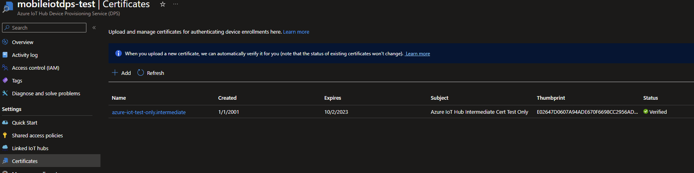
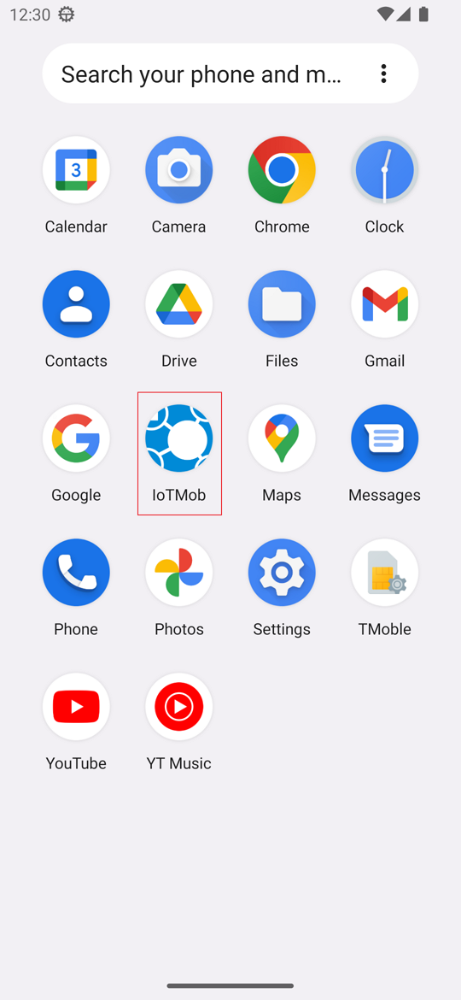
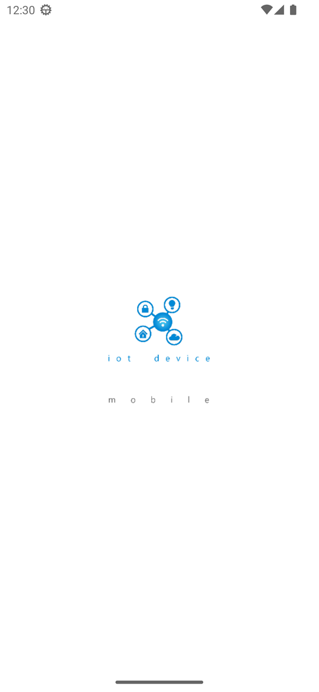
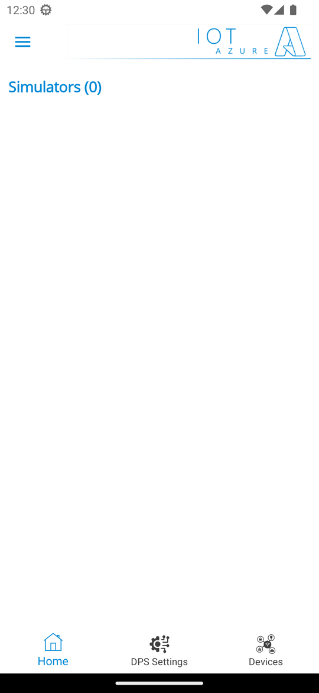
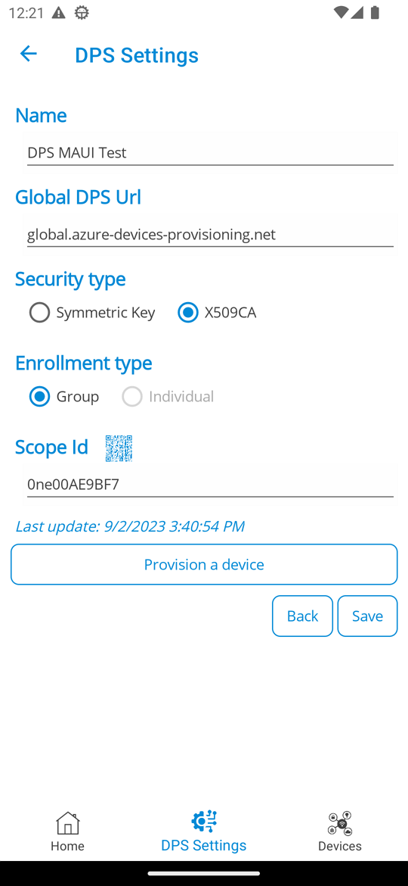

# IoT Device Mobile - New features - X509

Starting from v1.3.736, the application includes a long awaited feature: support of X509 provisioning (enrollment group mode).
There have been a "few" tricky parts to deal with when it comes to make everything work with MAUI and Android.
This said, the feature is now ready to be used and this documentation will explain you how.

This documentation describes:
 - how to create the whole PKI and certificates chain (CA, intermediates, leafs)
 - how to configure Azure IoT Hub DPS to use X509 certificates
 - how to use X509 certificates in the app


# Resources
 
 The features and this documentation are mainly based on the content of the following resources:
  - [Content based on this post](https://learn.microsoft.com/en-us/azure/iot-dps/tutorial-custom-hsm-enrollment-group-x509?tabs=linux&pivots=programming-language-csharp&WT.mc_id=AZ-MVP-5004280)

Android required a specific way of doing a certain number of things.


>IMPORTANT NOTE (GENERIC)
>Microsoft TLS certificates update
>https://techcommunity.microsoft.com/t5/internet-of-things-blog/azure-iot-tls-critical-changes-are-almost-here-and-why-you/ba-p/2393169
>https://www.digicert.com/kb/digicert-root-certificates.htm
>https://www.digicert.com/kb/digicert-root-community-certificates.htm
>https://www.ccadb.org/
>

# Prerequisites

- Azure IoT Hub
- Azure IoT Hub DPS
- Install the App
- OpenSSL 1.1.1 (the version is important)


# Global steps

- Create the Azure IoT Hub instance (if needed)
- Create the Azure IoT Hub DPS instance (if needed)

- Create the PKI with the root CA, intermediate CA and devices certificates
- Update/adapt certificate formats from the initial created certificates
- Upload the root and intermediate X509 certificates to the Azure IoT Hub DPS instance
- Verify the uploaded certificates
- Create an enrollment group

- Install the root and intermediate certificates in the device?
- Install the leaf certificate in the device
- Install the mobile application (if needed)
  
- Configure the Azure IoT Hub DPS settings in the mobile application
- Provision a device in the mobile application
- Configure the provisioned device
- Initiate the simulation
- Check that bidirectional flows are working

This makes quite a lot of steps.
This document will guide you in each of them.

>NOTE
>
>Before going any further, it is important to check the version of OpenSSL you are using (needed version: 1.1.1).
>

# Let's start ...

## Create the Azure IoT Hub instance (if needed)

If you do not have an Azure IoT Hub instance, you can create one using the Azure Portal.
See [this documentation](https://docs.microsoft.com/en-us/azure/iot-hub/iot-hub-create-through-portal?WT.mc_id=AZ-MVP-5004280) for more details.

## Create the Azure IoT Hub DPS instance (if needed)

If you do not have an Azure IoT Hub DPS instance, you can create one using the Azure Portal.
See [this documentation](https://docs.microsoft.com/en-us/azure/iot-dps/quick-setup-auto-provision?WT.mc_id=AZ-MVP-5004280) for more details.

## Create the PKI with the root CA, intermediate CA and devices certificates

### Steps

#### Step 0 - Navigate to the right folder

Create a working folder where all the needed files will be created.

#### Step 1 - OpenSSL configuration file for the root CA certificate

Create a __openssl_root_ca.cnf__ file with the flowing content:

```
# OpenSSL root CA configuration file.

[ ca ]
default_ca = CA_default

[ CA_default ]
# Directory and file locations.
dir               = .
certs             = $dir/certs
crl_dir           = $dir/crl
new_certs_dir     = $dir/newcerts
database          = $dir/index.txt
serial            = $dir/serial
RANDFILE          = $dir/private/.rand

# The root key and root certificate.
private_key       = $dir/private/azure-iot-test-only.root.ca.key.pem
certificate       = $dir/certs/azure-iot-test-only.root.ca.cert.pem

# For certificate revocation lists.
crlnumber         = $dir/crlnumber
crl               = $dir/crl/azure-iot-test-only.intermediate.crl.pem
crl_extensions    = crl_ext
default_crl_days  = 30

# SHA-1 is deprecated, so use SHA-2 instead.
default_md        = sha256

name_opt          = ca_default
cert_opt          = ca_default
default_days      = 375
preserve          = no
policy            = policy_loose

[ policy_strict ]
# The root CA should only sign intermediate certificates that match.
countryName             = optional
stateOrProvinceName     = optional
organizationName        = optional
organizationalUnitName  = optional
commonName              = supplied
emailAddress            = optional

[ policy_loose ]
# Allow the intermediate CA to sign a more diverse range of certificates.
countryName             = optional
stateOrProvinceName     = optional
localityName            = optional
organizationName        = optional
organizationalUnitName  = optional
commonName              = supplied
emailAddress            = optional

[ req ]
default_bits        = 2048
distinguished_name  = req_distinguished_name
string_mask         = utf8only

# SHA-1 is deprecated, so use SHA-2 instead.
default_md          = sha256

# Extension to add when the -x509 option is used.
x509_extensions     = v3_ca

[ req_distinguished_name ]
# See <https://en.wikipedia.org/wiki/Certificate_signing_request>.
countryName                     = Country Name (2 letter code)
stateOrProvinceName             = State or Province Name
localityName                    = Locality Name
0.organizationName              = Organization Name
organizationalUnitName          = Organizational Unit Name
commonName                      = Common Name
emailAddress                    = Email Address

# Optionally, specify some defaults.
countryName_default             = US
stateOrProvinceName_default     = WA
localityName_default            =
0.organizationName_default      = My Organization
organizationalUnitName_default  =
emailAddress_default            =

[ v3_ca ]
# Extensions for a typical CA.
subjectKeyIdentifier = hash
authorityKeyIdentifier = keyid:always,issuer
basicConstraints = critical, CA:true
keyUsage = critical, digitalSignature, cRLSign, keyCertSign

[ v3_intermediate_ca ]
# Extensions for a typical intermediate CA.
subjectKeyIdentifier = hash
authorityKeyIdentifier = keyid:always,issuer
basicConstraints = critical, CA:true
keyUsage = critical, digitalSignature, cRLSign, keyCertSign

[ usr_cert ]
# Extensions for client certificates.
basicConstraints = CA:FALSE
nsComment = "OpenSSL Generated Client Certificate"
subjectKeyIdentifier = hash
authorityKeyIdentifier = keyid,issuer
keyUsage = critical, nonRepudiation, digitalSignature, keyEncipherment
extendedKeyUsage = clientAuth

[ server_cert ]
# Extensions for server certificates.
basicConstraints = CA:FALSE
nsComment = "OpenSSL Generated Server Certificate"
subjectKeyIdentifier = hash
authorityKeyIdentifier = keyid,issuer:always
keyUsage = critical, digitalSignature, keyEncipherment
extendedKeyUsage = serverAuth

[ crl_ext ]
# Extension for CRLs.
authorityKeyIdentifier=keyid:always

[ ocsp ]
# Extension for OCSP signing certificates.
basicConstraints = CA:FALSE
subjectKeyIdentifier = hash
authorityKeyIdentifier = keyid,issuer
keyUsage = critical, digitalSignature
extendedKeyUsage = critical, OCSPSigning
```

#### Step 2 - OpenSSL configuration file for the intermediate and device certificates

Create a __openssl__device_intermediate_ca.cnf__ file with the flowing content:

```
# OpenSSL root CA configuration file.

[ ca ]
default_ca = CA_default

[ CA_default ]
# Directory and file locations.
dir               = .
certs             = $dir/certs
crl_dir           = $dir/crl
new_certs_dir     = $dir/newcerts
database          = $dir/index.txt
serial            = $dir/serial
RANDFILE          = $dir/private/.rand

# The root key and root certificate.
private_key       = $dir/private/azure-iot-test-only.intermediate.key.pem
certificate       = $dir/certs/azure-iot-test-only.intermediate.cert.pem

# For certificate revocation lists.
crlnumber         = $dir/crlnumber
crl               = $dir/crl/azure-iot-test-only.intermediate.crl.pem
crl_extensions    = crl_ext
default_crl_days  = 30

# SHA-1 is deprecated, so use SHA-2 instead.
default_md        = sha256

name_opt          = ca_default
cert_opt          = ca_default
default_days      = 375
preserve          = no
policy            = policy_loose

[ policy_strict ]
# The root CA should only sign intermediate certificates that match.
countryName             = optional
stateOrProvinceName     = optional
organizationName        = optional
organizationalUnitName  = optional
commonName              = supplied
emailAddress            = optional

[ policy_loose ]
# Allow the intermediate CA to sign a more diverse range of certificates.
countryName             = optional
stateOrProvinceName     = optional
localityName            = optional
organizationName        = optional
organizationalUnitName  = optional
commonName              = supplied
emailAddress            = optional

[ req ]
default_bits        = 2048
distinguished_name  = req_distinguished_name
string_mask         = utf8only

# SHA-1 is deprecated, so use SHA-2 instead.
default_md          = sha256

# Extension to add when the -x509 option is used.
x509_extensions     = v3_ca

[ req_distinguished_name ]
# See <https://en.wikipedia.org/wiki/Certificate_signing_request>.
countryName                     = Country Name (2 letter code)
stateOrProvinceName             = State or Province Name
localityName                    = Locality Name
0.organizationName              = Organization Name
organizationalUnitName          = Organizational Unit Name
commonName                      = Common Name
emailAddress                    = Email Address

# Optionally, specify some defaults.
countryName_default             = US
stateOrProvinceName_default     = WA
localityName_default            =
0.organizationName_default      = My Organization
organizationalUnitName_default  =
emailAddress_default            =

[ v3_ca ]
# Extensions for a typical CA.
subjectKeyIdentifier = hash
authorityKeyIdentifier = keyid:always,issuer
basicConstraints = critical, CA:true
keyUsage = critical, digitalSignature, cRLSign, keyCertSign

[ v3_intermediate_ca ]
# Extensions for a typical intermediate CA.
subjectKeyIdentifier = hash
authorityKeyIdentifier = keyid:always,issuer
basicConstraints = critical, CA:true
keyUsage = critical, digitalSignature, cRLSign, keyCertSign

[ usr_cert ]
# Extensions for client certificates.
basicConstraints = CA:FALSE
nsComment = "OpenSSL Generated Client Certificate"
subjectKeyIdentifier = hash
authorityKeyIdentifier = keyid,issuer
keyUsage = critical, nonRepudiation, digitalSignature, keyEncipherment
extendedKeyUsage = clientAuth

[ server_cert ]
# Extensions for server certificates.
basicConstraints = CA:FALSE
nsComment = "OpenSSL Generated Server Certificate"
subjectKeyIdentifier = hash
authorityKeyIdentifier = keyid,issuer:always
keyUsage = critical, digitalSignature, keyEncipherment
extendedKeyUsage = serverAuth

[ crl_ext ]
# Extension for CRLs.
authorityKeyIdentifier=keyid:always

[ ocsp ]
# Extension for OCSP signing certificates.
basicConstraints = CA:FALSE
subjectKeyIdentifier = hash
authorityKeyIdentifier = keyid,issuer
keyUsage = critical, digitalSignature
extendedKeyUsage = critical, OCSPSigning
```

#### Root CA

This section describes how to create the Root CA.

##### Step 3 - Create folders

```bash
mkdir certs csr newcerts private
touch index.txt
openssl rand -hex 16 > serial
```

##### Step 4 - Create the root CA private key

```bash
openssl genrsa -aes256 -passout pass:1234 -out ./private/azure-iot-test-only.root.ca.key.pem 4096
```

##### Step 5 - Create the root CA Certificate

```bash
openssl req -new -x509 -config ./openssl_root_ca.cnf -passin pass:1234 -key ./private/azure-iot-test-only.root.ca.key.pem -subj '/CN=Azure IoT Hub CA Cert Test Only' -days 30 -sha256 -extensions v3_ca -out ./certs/azure-iot-test-only.root.ca.cert.pem
```

##### Step 6 - Examine the root CA Certificate

```bash
openssl x509 -noout -text -in ./certs/azure-iot-test-only.root.ca.cert.pem
```

#### Intermadiate CA

This section describes how to create the intermediate CA.

##### Step 7 - Create the intermediate CA private key

```bash
openssl genrsa -aes256 -passout pass:1234 -out ./private/azure-iot-test-only.intermediate.key.pem 4096
```

##### Step 8 - Create the intermediate A certificate signing request (CSR)

```bash
openssl req -new -sha256 -passin pass:1234 -config ./openssl_device_intermediate_ca.cnf -subj '/CN=Azure IoT Hub Intermediate Cert Test Only' -key ./private/azure-iot-test-only.intermediate.key.pem -out ./csr/azure-iot-test-only.intermediate.csr.pem
```
##### Step 9 - Sign the intermediate certificate with the root CA certificate

```bash
openssl ca -batch -config ./openssl_root_ca.cnf -passin pass:1234 -extensions v3_intermediate_ca -days 30 -notext -md sha256 -in ./csr/azure-iot-test-only.intermediate.csr.pem -out ./certs/azure-iot-test-only.intermediate.cert.pem
```

##### Step 10 - Examine the intermediate CA certificate

```bash
openssl x509 -noout -text -in ./certs/azure-iot-test-only.intermediate.cert.pem
```

#### Devices

This section describes how to create the device certificates (aka leaf certificates).

##### Step 11 - Create a device private key (device-01)

```bash
openssl genrsa -out ./private/maui-device-01.key.pem 4096
```

##### Step 12 - Create the device certificate CSR

>NOTE
>
> CN needs to be set to the registration Id.
> 
> The registration Id is:
> - case insensitive
> - alphanumeric or '-', '.', '_', ':'
> - the last charater must be alphanumeric or '-'
> - up to 128 characters long
> - however, a CN name in X509 is up to 64 characters
> 
> The registration Id is used as the device Id in IoT Hub

```bash
openssl req -config ./openssl_device_intermediate_ca.cnf -key ./private/maui-device-01.key.pem -subj '/CN=maui-device-01' -new -sha256 -out ./csr/maui-device-01.csr.pem
```

##### Step 13 - Sign the device certificate

```bash
openssl ca -batch -config ./openssl_device_intermediate_ca.cnf -passin pass:1234 -extensions usr_cert -days 30 -notext -md sha256 -in ./csr/maui-device-01.csr.pem -out ./certs/maui-device-01.cert.pem
```

##### Step 14 - Examine the device certificate

```bash
openssl x509 -noout -text -in ./certs/maui-device-01.cert.pem
```

##### Step 15 - Create the full certificate chain for the device (needed by DPS)

```bash
cat ./certs/maui-device-01.cert.pem ./certs/azure-iot-test-only.intermediate.cert.pem ./certs/azure-iot-test-only.root.ca.cert.pem > ./certs/maui-device-01-full-chain.cert.pem
```

##### Step 16 - Examine the full certificate

Open the full certificate with a text editor and check that it contains the 3 certificates concatenated.

##### Step 17 - Create other devices if needed

```bash
registration_id=maui-device-02
echo $registration_id
openssl genrsa -out ./private/${registration_id}.key.pem 4096
openssl req -config ./openssl_device_intermediate_ca.cnf -key ./private/${registration_id}.key.pem -subj "/CN=$registration_id" -new -sha256 -out ./csr/${registration_id}.csr.pem
openssl ca -batch -config ./openssl_device_intermediate_ca.cnf -passin pass:1234 -extensions usr_cert -days 30 -notext -md sha256 -in ./csr/${registration_id}.csr.pem -out ./certs/${registration_id}.cert.pem
cat ./certs/${registration_id}.cert.pem ./certs/azure-iot-test-only.intermediate.cert.pem ./certs/azure-iot-test-only.root.ca.cert.pem > ./certs/${registration_id}-full-chain.cert.pem
```

##### Update/adapt certificate formats from the initial created certificates

```bash
openssl pkcs12 -inkey ./private/maui-device-01.key.pem -in ./certs/maui-device-01-full-chain.cert.pem -export -passin pass:1234 -passout pass:1234 -out ./certs/maui-device-01-full-chain.cert.pfx -keypbe PBE-SHA1-3DES -certpbe PBE-SHA1-3DES
```

>NOTE
>
>The specific -keypbe and -certpbe options are needed for Android.
>The default RC2 algorithm is not supported on Android.
>
>This command needs OpenSSL 1.1.1.
>

##### Upload the intermediate X509 certificates to the Azure IoT Hub DPS instance


[Details](https://learn.microsoft.com/en-us/azure/iot-dps/tutorial-custom-hsm-enrollment-group-x509?tabs=linux&pivots=programming-language-csharp&WT.mc_id=AZ-MVP-5004280#verify-ownership-of-the-root-certificate)

>NOTE
>
>The link mentions the root certificate. In our case, we only need the intermediate certificate.
>




##### Verify the uploaded certificates

[Details](https://learn.microsoft.com/en-us/azure/iot-dps/tutorial-custom-hsm-enrollment-group-x509?tabs=linux&pivots=programming-language-csharp&WT.mc_id=AZ-MVP-5004280#verify-ownership-of-the-root-certificate)

## Create an enrollment group

If you do not have an enrollment group, you can create one using the Azure Portal.
See [this documentation](https://docs.microsoft.com/en-us/azure/iot-dps/how-to-manage-enrollments?WT.mc_id=AZ-MVP-5004280) for more details.


## Install the intermediate certificate in the device (needed for DPS communication)

 - copy the *.pem intermediate CA certificate in the device
 - Install it on the device going to Settings -> Security -> More security settings -> Encryption & credentials -> Install a certificate -> CA certificate

## Install the leaf certificate in the device

- copy the leaf certificate (pfx), with the full trust chain, in the device
- Install it on the device going to Settings -> Security -> More security settings -> Encryption & credentials -> Install a certificate -> VPN & app user certificate

It is possible that Android will install it directly when you will download it to the device.
If it is the case, you will need to provide the password used previously (1234), to install it.

## Install the mobile application (if needed)

If you have not installed the IoT Device Mobile application yet, you can install it from the [Google Play Store](https://play.google.com/store/apps/details?id=jmi.iot.device.mobile).





## Configure the Azure IoT Hub DPS settings in the mobile application



<br/>



<br/>



<br/>

[Details](https://techcommunity.microsoft.com/t5/internet-of-things-blog/transform-your-phone-into-an-iot-device-with-net-maui/ba-p/3673909?WT.mc_id=AZ-MVP-5004280)


## Provision a device in the mobile application

[Details](https://techcommunity.microsoft.com/t5/internet-of-things-blog/transform-your-phone-into-an-iot-device-with-net-maui/ba-p/3673909?WT.mc_id=AZ-MVP-5004280)

## Configure the provisioned device

[Details](https://techcommunity.microsoft.com/t5/internet-of-things-blog/transform-your-phone-into-an-iot-device-with-net-maui/ba-p/3673909?WT.mc_id=AZ-MVP-5004280)

## Initiate the simulation

[Details](https://techcommunity.microsoft.com/t5/internet-of-things-blog/transform-your-phone-into-an-iot-device-with-net-maui/ba-p/3673909?WT.mc_id=AZ-MVP-5004280)

## Check that bidirectional flows are working

[Details](https://techcommunity.microsoft.com/t5/internet-of-things-blog/transform-your-phone-into-an-iot-device-with-net-maui/ba-p/3673909?WT.mc_id=AZ-MVP-5004280)

