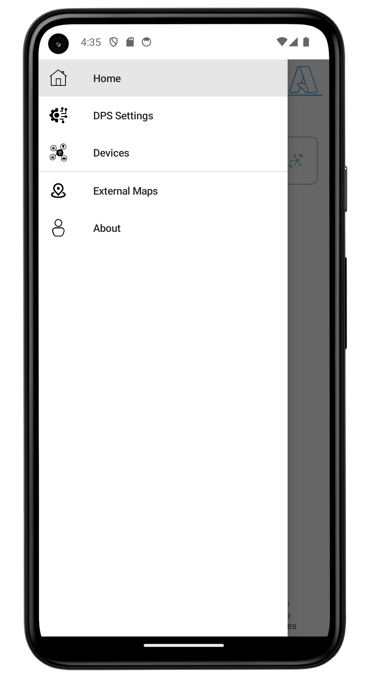
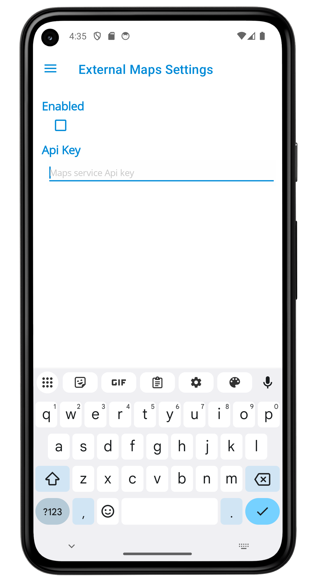

# Azure IoT Simulator - Mobile application - Teltonika

This version of the mobile application is based on the [Azure IoT Simulator - Mobile application](iot-simulator-mobileapp.md).
As the title suggests, this new version is designed to include features specific to Teltonika's contexts.

## Features

The Teltonika version of the mobile application includes the following features:
 - telemetry based on Teltonika's Codec 8E
 - (optional) coherent random GPS data

### Telemetry (Codec 8E)

This initial version creates telemetry messages with a fixed set of properties.

These properties are serialized in a HEX string, following the Codec 8E format.

List of currently used properties (Event Ids):

 - 16, total odometer
 - 21, gsm signal strength
 - 24, speed
 - 66, external voltage
 - 67, battery voltage
 - 80, data mode
 - 81, vehicle speed
 - 89, fuel level
 - 152, hv battery level
 - 200, sleep mode
 - 239, ignition
 - 240, movement
 - 391, private mode
 - 400, distance next service
 - 654, front left door open
 - 655, front right door open
 - 656, rear left door open
 - 657, rear right door open
 - 658, trunk door open

The codec is described [here](https://wiki.teltonika-gps.com/view/Codec).

Event Ids are described [here](https://wiki.teltonika-gps.com/view/FMB120_Teltonika_Data_Sending_Parameters_ID).

When the telemetry generation is started, an event is sent (Ignition On) simulating how a vehicle starts.
Similarly, when the telemetry generation is stopped, an event is sent (Ignition Off) simulating how a vehicle stops.

### GPS data

When it comes to routes or paths, it might be helpful to generate coherent GPS data. By "coherent" we mean meaningful data in terms of:
 - position (ordered)
 - speed
 - time
 - according to a route

This version of the application uses Azure Maps to implement part of the feature.
Required credentials are configurable in the application.

 # The app

 You can download the app from the [Google Play Store](https://play.google.com/store/apps/details?id=jmi.iot.device.mobile.teltonika).